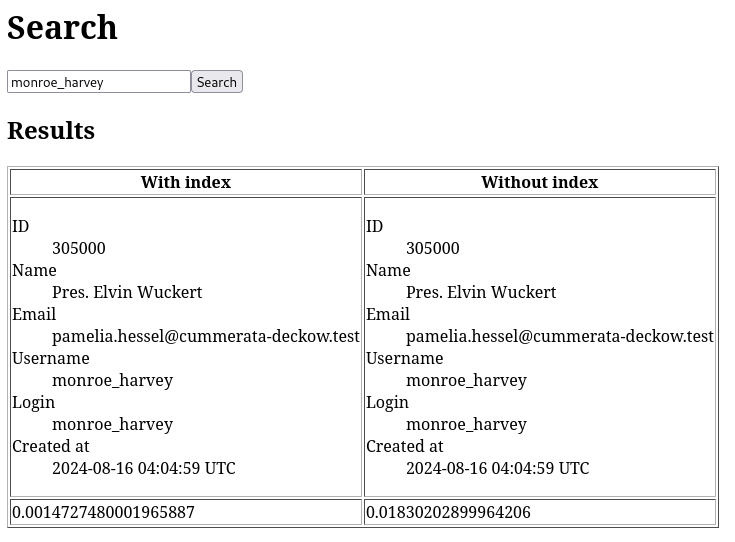

# README

## Description
This project focuses on evaluating the performance impact of database indexing on search queries. It features a single model, `User`, with a corresponding database table that includes two columns: `username` and `login`. The table has a single index on the `username` column.

A rake task, `tmp:load_sample_data`, is provided to generate 2 million user records, where each record has identical values for both the `username` and `login` fields.

The `/search` endpoint hosts a search form that allows users to perform queries based on either `username` or `login`. The results page benchmarks and displays the execution time for each query, enabling a direct comparison of the search performance with and without the use of an index on these fields.



## Objective
Simple project to test performance improvements of use database indexes

## Environment
- Ruby 3.3.4
- Rails 7.2
- SQLite 3

## Setup

- Prepare database:
```
rails db:prepare
```
- Load sample data with a rake task, you can configure the number of records with the variable NUMBER, the default value is 2 millions
```
rails tmp:load_sample_data
```

## TODO
- Add docker setup
- Use Javascript to load search in parallel
- Improve styles
